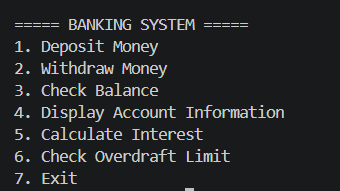
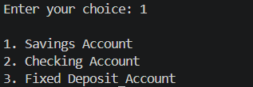
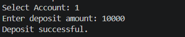
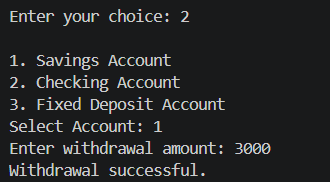
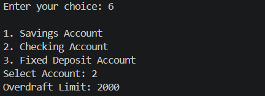
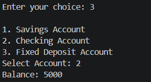
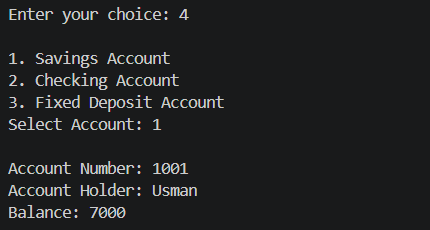
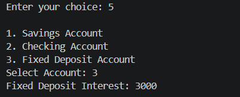

# Banking System (C++)

## Project Overview

The **Banking System** is a menu-driven C++ console application that demonstrates object-oriented programming through a simple banking simulation. It includes a base `BankAccount` class and three derived account types: `SavingsAccount`, `CheckingAccount`, and `FixedDepositAccount`.

The application lets users deposit and withdraw money, check balances, view account information, calculate interest for eligible accounts, and check the overdraft limit for a checking account

## Main Features

- **Deposit Money:** Add a valid amount to an account balance.
- **Withdraw Money:** Withdraw money when the account has sufficient funds; checking accounts can use an overdraft facility up to their configured limit.
- **Check Balance:** View the current balance of a selected account.
- **Display Account Information:** View the account number, account holder, and balance.
- **Calculate Interest:** Calculate interest for savings and fixed-deposit accounts.
- **Check Overdraft Limit:** View the overdraft limit for a checking account.
- **Menu-Based Navigation:** Select an operation and account type from the console menu.

---

## 1. Main Menu

The main menu displays the available banking operations. The user selects an option and then chooses the account to use.

### Screenshot

---

## 2. Deposit Money

The Deposit Money option asks for an amount and adds it to the selected account's balance. A success message is displayed for a valid positive amount; invalid amounts are rejected.

### Screenshots

---

## 3. Withdraw Money

The Withdraw Money option allows the user to withdraw from the selected account. A checking account can withdraw beyond its available balance by using the overdraft facility, provided the configured overdraft limit is not exceeded.

### Screenshots

---

## 4. Account Details, Balance, and Interest

This section includes checking the current balance, displaying account information, calculating interest for savings and fixed-deposit accounts, and viewing the overdraft limit for checking accounts.

### Screenshots

**Check Balance**

**Display Account Information**

**Calculate Interest**

